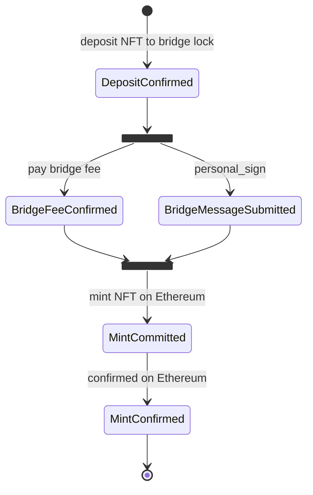

# CKB to Ethereum

## CKB -> Ethereum State Transition

## CKB <- Ethereum

TODO

## Terms

- Committed: transaction has committed on BlockChain, but not yet reached the confirmed height
- Confirmed: transaction has reached the confirmation height
